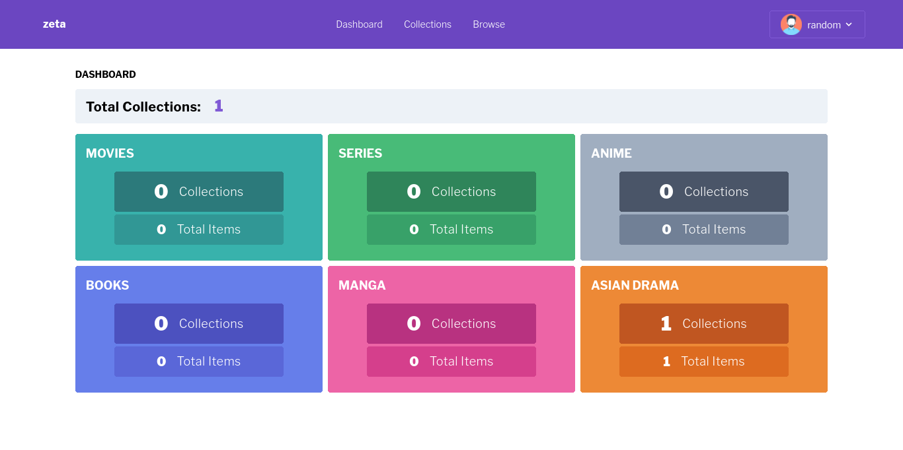

# zeta
A simple web app library for creating collections.

### Demo Site
https://zeta-library.herokuapp.com

## Features
- Classified Collections by type (Movies, Series, Anime, Manga, Book, Asian Drama)
- Simple user management
- Simple Dashboard for statistics

<!-- dashboard image -->

- Browse functionality for searching items on the internet

## API's Used:
- TMDB Api (https://www.themoviedb.org)
    - Used in Movies and Series
- Jikan API (https://jikan.docs.apiary.io/)
    - Used in Anime and Manga
- OpenLibrary (https://openlibrary.org)
    - Used in Books
- Kuryana (https://github.com/TheBoringDude/kuryana)
    - Used in Asian Drama

### Some things to NOTE on installing and using the app:
- Some Asian Dramas are included in Movies and Series API, it would then depend on the user how he/she classfies 'em.
- The app only stores the Poster Image and Title of an Item in the collection. It is not made as a tracker *(but this might be included if possible in the future)* but just some collection for random stuffs.
- There might be some page design changes in the near future.

## TBA (To Be Added) / TODO:
- [ ] Add user Reset Password functionality (Forgot Password?)
- [ ] A User should be able to change his/her profile picture
- [ ] Capability to add custom items in the collections
- [ ] Fix future errors and bugs in the future
- [ ] etx...

##### Made By:
**:heart: TheBoringDude**